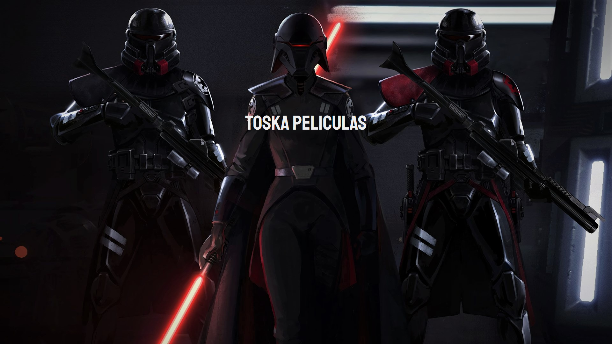
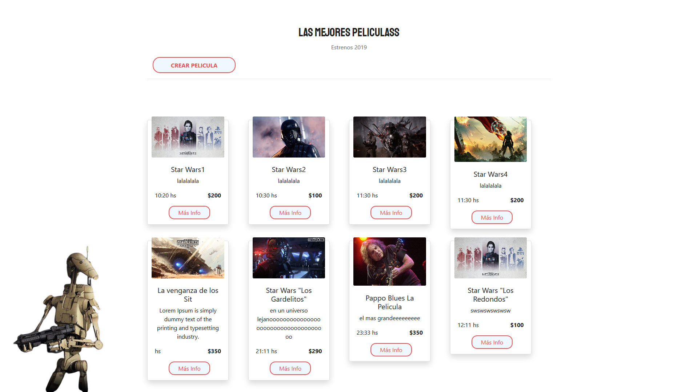
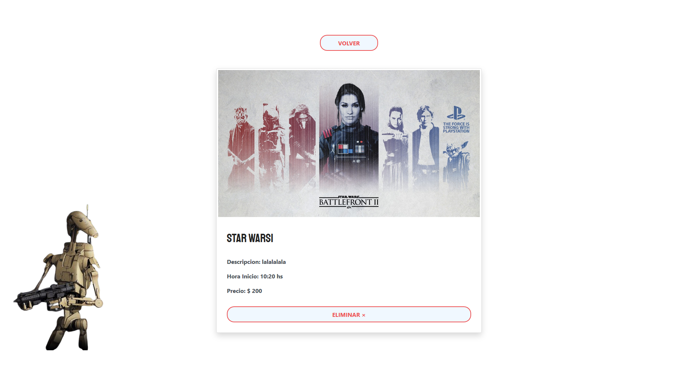
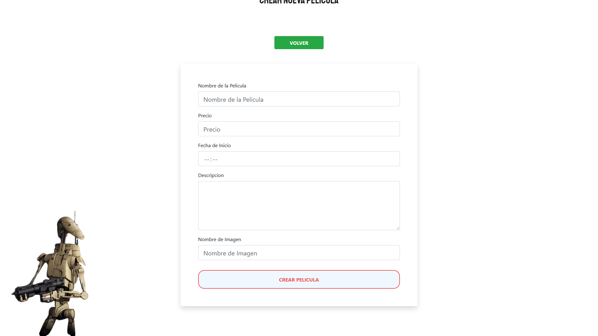

<h1>FullStack Mern </h1>

Ejecutar backend con "npm run dev"

Ejecutar frontend con "npm start"

 
      
      
     

 

 
      
      
     

 

 
      
      
     

 

 
      
      
     

 

